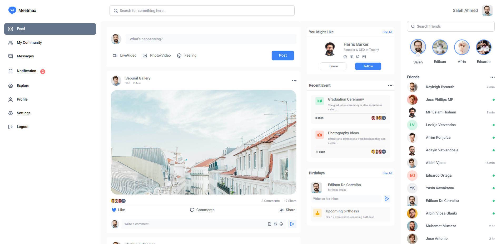
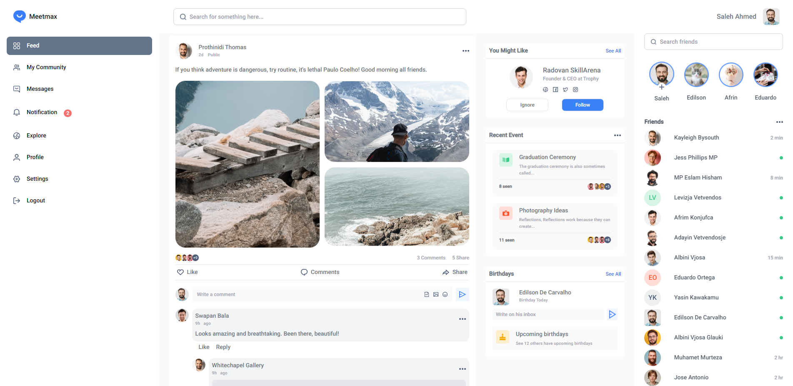

# Meetmax - Social Network App

Meetmax is a social network application built using Next.js 14, Tailwind CSS, Next Auth, React, react-datepicker, and uuid. The project also utilizes ESLint for code quality and linting.

## Features

- **Sign Up**: Users can create a new account by providing their email, password, name, dob & gender information.
- **Sign In**: Users can sign in to the application using their custom email and password, or by signing in with their Apple/Google account.
- **Authentication**: Secure Authentication using Next Auth.
- **State Management**: The application uses state management to handle user authentication and other data.
- **Logout**: Users can log out of the application.
- **Auth Page UI Design**: The authentication pages (Sign Up, Sign In, Remember Password) have a clean and modern user interface design.
- **Feed Page UI Design**: The main feed page where users can view and interact with content has a visually appealing design.
- **Fully Responsive Design**: The application is designed to be fully responsive and works well on various devices and screen sizes.

## Technologies Used

- **Next.js 14**: A React framework for building server-rendered and static websites.
- **Tailwind CSS**: A utility-first CSS framework for rapidly building custom user interfaces.
- **Next Auth**: A flexible authentication solution for Next.js applications.
- **React**: A JavaScript library for building user interfaces.
- **react-datepicker**: A customizable date picker component for React.
- **uuid**: A library for generating unique IDs.
- **ESLint**: A tool for identifying and reporting on patterns in JavaScript code.

## Getting Started

To run the MeetMax application locally, follow these steps:

1. Clone the repository: `git clone https://github.com/masrur-sakib/meetmax.git`
2. Install dependencies: `npm install`
3. Set up environment variables, Create a .env.local file in the root directory. Add environment variables for Next Auth and other services.
4. Run the development server: `npm run dev`
5. Open the application in your browser: `http://localhost:3000`

## Setup .env file

```js
AUTH_SECRET="yumRbutgSuU/fY7TaYDPgMW8HsjVHKQitnkkjlxp6jA="

NEXTAUTH_URL=http://localhost:3000
NEXTAUTH_SECRET="yumRbutgSuU/fY7TaYDPgMW8HsjVHKQitnkkjlxp6jA="

APPLE_ID=your_apple_client_id
APPLE_SECRET=your_apple_client_secret

GOOGLE_ID=your_google_client_id
GOOGLE_SECRET=your_google_client_secret
```

## Usage

- **Sign Up**: Create a new account using your email or sign up with Apple or Google.
- **Sign In**: Log in with your credentials or use Apple or Google for quick access.
- **Explore Feed**: Browse the feed page to view content from other users.
- **Logout**: Securely log out from the application.

#### Live Site Link - https://meetmax-delta.vercel.app/

## Screenshots







